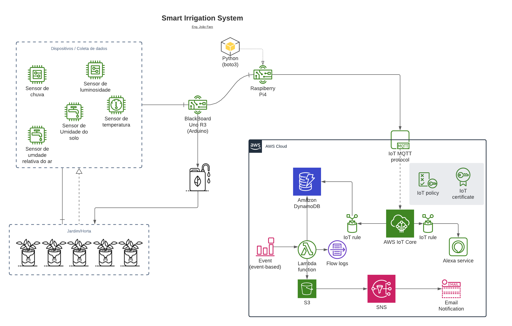

# irrigation-service-mqtt
Repositório responsável pelo projeto Sistema de Irrigação inteligente - módulo de publicação das mensagens por MQTT

Projeto de medição e análise de umidade do solo, temperatura, umidade relativa do ar, além de utilizar sensores de chuva 
e irrigação do solo de forma automática de acordo com valores obtidos do Arduíno e enviados a este software que está 
armazenado em um Raspberry PI.

## OBS
Projeto ainda não está concluído, portanto vai haver mais de 1 porta (Atualmente no código) para captura de dados.

## Arquitetura

### Módulos

* Irrigation service (python - mqtt)
* Sketch Arduíno (C++ - envia dados para o RaspberryPi)
* Lambda (AWS - recupera dados da medição por período definido e envia para o S3)

## License
[Apache 2.0](https://choosealicense.com/licenses/apache-2.0/)